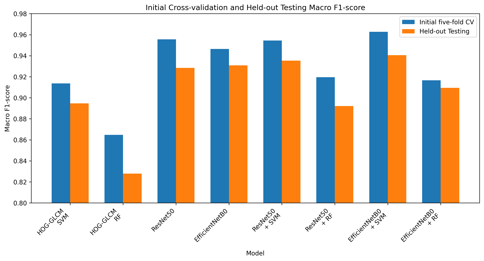

# Brain Tumour MRI Classification

A comparative study of classical machine learning, deep learning and hybrid models for multi-class brain tumour classification using MRI images.

This project was completed as part of the MSc Data Science programme at Birkbeck, University of London.

## Project Overview

The aim of the project was to compare different approaches to classifying brain MRI images into four classes:

- Glioma
- Meningioma
- Pituitary tumour
- No tumour

The study compared traditional machine learning models, deep learning models and hybrid approaches using features extracted from convolutional neural networks.

## Models Evaluated

Eight model configurations were evaluated:

- HOG + GLCM features with Support Vector Machine
- HOG + GLCM features with Random Forest
- ResNet50
- EfficientNetB0
- ResNet50 features with Support Vector Machine
- ResNet50 features with Random Forest
- EfficientNetB0 features with Support Vector Machine
- EfficientNetB0 features with Random Forest

## Evaluation

Models were evaluated using repeated stratified cross-validation and a separate held-out test set.

Macro F1-score was used as the main evaluation metric.

The best-performing model was:

**EfficientNetB0 features + Support Vector Machine**

Results:

- Mean macro F1 across repeated cross-validation: **0.9636**
- Held-out test macro F1: **0.9405**

## Results Summary

The figure below compares cross-validation and held-out test macro F1 scores across the evaluated models.

## Project Structure

- `notebooks/` – data exploration, model development, evaluation and statistical analysis
- `scripts/` – supporting Python scripts
- `results/` – model evaluation and hyperparameter tuning outputs
- `repeated_cv/` – repeated cross-validation results
- `splits/` – dataset split information
- `project_protocol.md` – project protocol and methodology

## Technologies

- Python
- TensorFlow / Keras
- scikit-learn
- OpenCV
- NumPy
- pandas
- scikit-image
- Machine Learning
- Deep Learning
- Computer Vision
